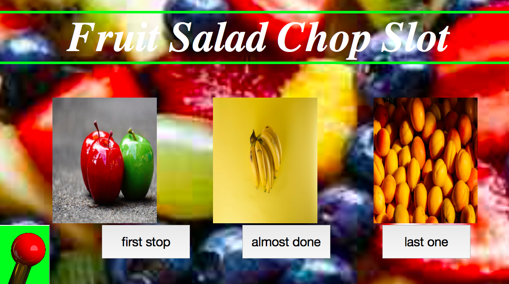

# Slot-Machine

A fun fruit slot-machine.

## How It's Made:

**Tech used:** HTML, CSS, JavaScript

Made a slot-machine where the User can enter a beginning amount bet a min of 10% of that amount or max 50% of that amount until they are out of cash or done playing.

## Lessons Learned:

first time using a sort of animation in my code. it was very confusing understanding the small things like timing and the betting system but some help from colleauges and some research really helped.
